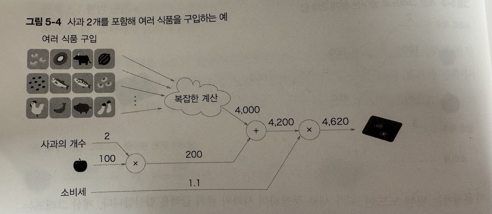
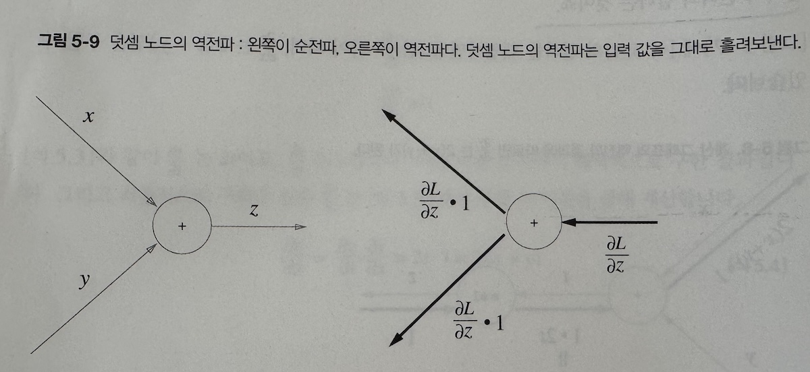
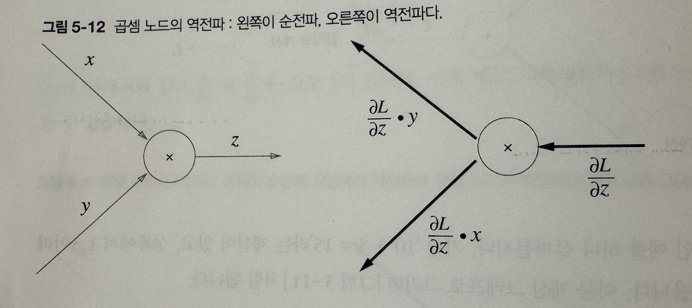
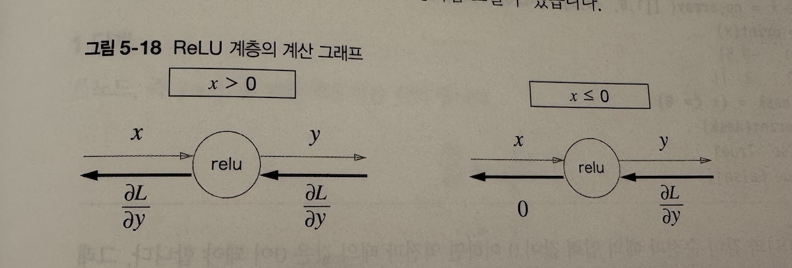
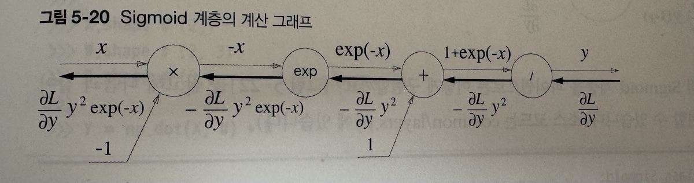
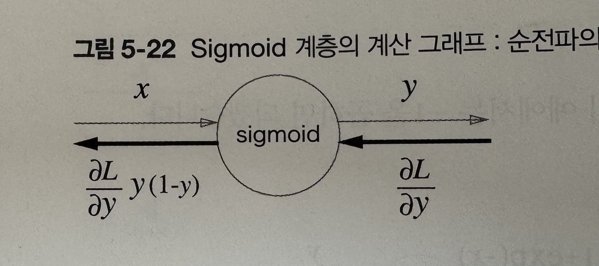
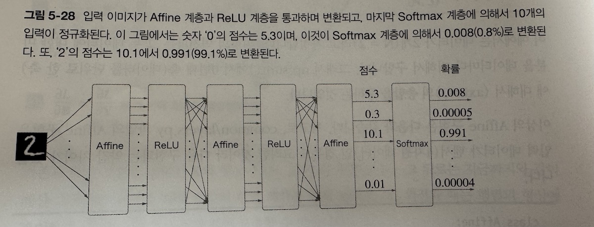
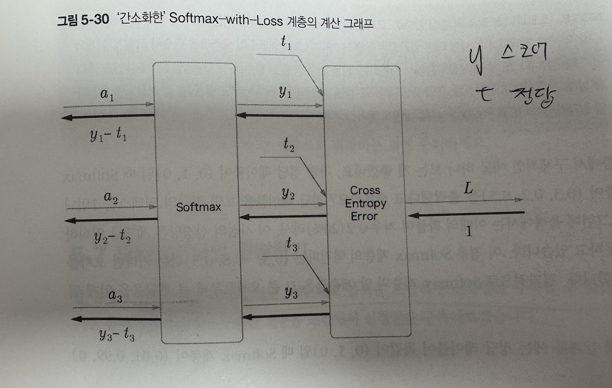

# 5. 오차역전파법(Backpropagation)
https://serokell.io/blog/understanding-backpropagation


수치미분을 활용해서 오차의 변화를 계산하기 위해서는 많은 컴퓨팅 파워가 필요하고 느리다. 

때문에 오차역전파법이라는 효율적인 방법으로 접근한다.


## 5.1. 계산 그래프
수식으로 이해하는 것보다 시각적인 그래프로 표현 계산을 표현할 수 있어 이해하기 쉽다.
```
[사과] -100--> [ x2 ] -200-> [x 1.1] -220-> [사과 가격]
```
사과(100) * 2개 * 소비세 10% = 사과가격
```
----100----> [ X ] ---200---> [ X ] ---220-->  사과 가격
            /                   /
           2                 /
사과 개수 --/                 /
                          /
소비세 -------1.1---------/
```
   > 왼쪽에서 오른쪽으로 계산을 진행한다. => forword propagation 

역전파는?

  > back propagation

## 5.1.2. 국소적 계산



계산 그래프의 특징은 '국소적 계산'을 전파함으로써 최종결과를 얻을 수 있다는 장점이 있음.

-> 자신과 관계된 정보만으로 결과를 출력할 수 있다.

--> 모듈화?가 가능해진다.


### 5.1.3. 왜 계산 그래프로 푸는가?

 계산 그래프로 계산하면서
  >  1. 국소적인 계산을 할 수 있다
  >  2. 중간 계산 결과를 저장 할 수 있다.
  >  3. 역전파를 통해 미분을 효율적으로 계산할 수 있다.

    미분 => 변화량


### 5.2. 연쇄 법칙


```입력 -> 신경망 -> 출력 -> 오차 구하기```는 ```합성함수```로 생각 해 볼 수 있다.
각 출력이 다음 과정의 입력값이 된다

> 합성함수의 미분은 연쇄법칙으로!

즉 back propagation의 원리는 연쇄법칙에 따름.

### 5.2.1. 연쇄법칙

합성함수 미분 = 겉미분 * 속미분

$$
f(x) = f \left( l \left( m \left( n(x) \right) \right) \right)
$$

$$
\frac{df}{dx} = \frac{dn}{dx} \cdot \frac{dm}{dn} \cdot \frac{dl}{dm} \cdot \frac{df}{dl}
$$

### 5.3. 역전파

### 5.3.1. 덧셈노드의 역전파


덧셈은 그대로 흘려보낸다.


### 5.3.2. 곱셈 노드의 역전파


서로 바꾼 값을 곱해서 흘려준다.
곱셈의 역전파는 순방향의 입력 신호 값이 필요함.


## 5.4. 단순한 계층 구현하기
### 5.4.1. 곱셈 계층
```py
class MulLayer:
    def __init__(self):
        self.x = None
        self.y = None

    def forward(self, x, y):
        self.x = x
        self.y = y                
        out = x * y

        return out

    def backward(self, dout):
        dx = dout * self.y  # x와 y를 바꾼다.
        dy = dout * self.x

        return dx, dy
```
### 5.4.2. 덧셈 계층
```py
class AddLayer:
    def __init__(self):
        pass

    def forward(self, x, y):
        out = x + y

        return out

    def backward(self, dout):
        dx = dout * 1
        dy = dout * 1

        return dx, dy

```

```py
# coding: utf-8
from layer_naive import *

apple = 100
apple_num = 2
orange = 150
orange_num = 3
tax = 1.1

# layer
mul_apple_layer = MulLayer()
mul_orange_layer = MulLayer()
add_apple_orange_layer = AddLayer()
mul_tax_layer = MulLayer()

# forward
apple_price = mul_apple_layer.forward(apple, apple_num)  # (1)
orange_price = mul_orange_layer.forward(orange, orange_num)  # (2)
all_price = add_apple_orange_layer.forward(apple_price, orange_price)  # (3)
price = mul_tax_layer.forward(all_price, tax)  # (4)

# backward
dprice = 1
dall_price, dtax = mul_tax_layer.backward(dprice)  # (4)
dapple_price, dorange_price = add_apple_orange_layer.backward(dall_price)  # (3)
dorange, dorange_num = mul_orange_layer.backward(dorange_price)  # (2)
dapple, dapple_num = mul_apple_layer.backward(dapple_price)  # (1)

```

## 5.5. 활성화 함수 계층 구현하기
앞서 배운 활성화 함수들도 역전파, 순전파를 구현할 수 있다.

### 5.5.1. ReLU 계층



0보다 큰 입력 값이었을 때 미분값 그대로 보낸다.
```py
class Relu:
    def __init__(self):
        self.mask = None

    def forward(self, x):
        self.mask = (x <= 0)
        out = x.copy()
        out[self.mask] = 0

        return out

    def backward(self, dout):
        dout[self.mask] = 0
        dx = dout

        return dx

```
mask기능으로 Relu를 구현하고 있다.
forward할때 mask를 기억해둔다.

### 5.5.2. Sigmoid 계층
$$
\sigma(x) = \frac{1}{1 + e^{-x}}
$$

Sigmoid식은 다소 복잡하다. 하지만 이 역시 그래프로 표기가 가능하다.


엄청난 식을 정리하면 다음과 같이 간단해 진다.



```py

class Sigmoid:
    def __init__(self):
        self.out = None

    def forward(self, x):
        out = sigmoid(x)
        self.out = out
        return out

    def backward(self, dout):
        dx = dout * (1.0 - self.out) * self.out

        return dx
```

`out` 변수에 저장했다가 backward때 다시 사용한다. 

## 5.6. Affine/SoftMax 계층

입력층과 출력층인 Affine, softmax 계층에 대해 알아보자.
역시 순전파, 역전파로 표현 가능하다.

### 5.6.1. Affine 계층
Affine계층은 입력층으로 입력*가중치+편향 이다.

주의해야 할 것은 차원의 원소수를 일치 시키는 것이다.

affine계층의 유도는 수학적으로 증명할 수는 있지만 너무 어렵다고한다. 
~~그냥 그렇게 알고 있으라고..~~

### 5.6.3. Softmax-with-Loss 계층




